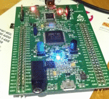

# STM32F4 Discovery board project template

This is a project template for the [STM32F4 Discovery board](http://www.st.com/web/catalog/tools/FM116/SC959/SS1532/PF252419),
a development and evaluation board for a popular ARM microcontroller.

It should also be able to be adapted for use with any microcontroller from the STM32F4 series.

It contains:

* a working toolchain for building and flashing software

* in `libs`, the [STM32F4 DSP and standard peripherals library](http://www2.st.com/content/st_com/en/products/embedded-software/mcus-embedded-software/stm32-embedded-software/stm32-standard-peripheral-libraries/stsw-stm32065.html),
  which has two main parts:

  * a set of header files with lots of useful constants (eg. registers defined by name)
  * a set of device drivers that abstract away some of the low-level hardware details

  The header files are quite useful, but I have mixed feelings about the device drivers. They do have some useful constants, and anything you don't use will be
  optimised out out of the final flash image.

* in `main`, a sample application that will flash the LEDs in a pattern to demonstrate everything is working OK:

  

This is a work in progress, but it should be ready for use. Please feel free to submit ideas, suggestions, issue reports and pull requests.

## Requirements

* [stlink](https://github.com/texane/stlink) - `brew install stlink` on OS X
* [CMake](http://cmake.org) - `brew install cmake` on OS X
* [GCC ARM toolchain](https://launchpad.net/gcc-arm-embdded) - `brew install gcc-arm-none-eabi-49` on OS X

I haven't tested this on anything other than OS X. There's no reason I know of that would prevent it from working on Linux.
Windows might be a bit more challenging though :)

## Setup
You should only need to run this once to set up the makefile:

  ```bash
  stm32f4-project-template $ mkdir build
  stm32f4-project-template $ cd build
  stm32f4-project-template/build $ cmake -DCMAKE_TOOLCHAIN_FILE=../toolchain-arm-none-eabi.cmake ..
  ```

## Building

  ```bash
  # In the build/ directory created in 'Setup' above
  stm32f4-project-template/build $ make
  ```

Note that if you add or remove any source code files, you'll need to run `cmake ..` again to get it to regenerate the makefile.
(This is because I'm using globbing and CMake [doesn't support detecting changes when using globbing](https://cmake.org/cmake/help/v3.3/command/file.html?highlight=We+do+not+recommend+using+GLOB).
If this annoys you, the alternative is to specify each file individually in the appropriate `CMakeLists.txt` file. I find globbing the lesser of two evils.)

## Flashing firmware
Connect the board to your computer with a USB-to-mini-USB cable (use the port at the top of the board, away from the buttons and audio jack -
the micro USB port at the front of the board is not for programming), then run:

  ```bash
  # In the build/ directory created in 'Setup' above
  stm32f4-project-template/build $ make flash_firmware
  ```

## Tips / gotchas

### IRQ handler isn't being executed

* Make sure your handler matches the name given in `stm32f407vg.S`.

* If your handler is in a C++ file, make sure it is compiled with C linkage (see [this Wikipedia page](https://en.wikipedia.org/wiki/Compatibility_of_C_and_C%2B%2B#Linking_C_and_C.2B.2B_code) for an explanation of why this is necessary).

  This means you should wrap your IRQ handler in `extern "C"`, like this:

  ```cpp
  extern "C" {
    void MyReallyCool_IRQHandler() {

    }
  }
  ```

## Acknowledgements and references

* [ST's STM32F4 DSP and standard peripherals library](http://www2.st.com/content/st_com/en/products/embedded-software/mcus-embedded-software/stm32-embedded-software/stm32-standard-peripheral-libraries/stsw-stm32065.html)

  Note that the files relating to the FMC have been removed as they are not relevant to the STM32F407 used on the Discovery board.

* [ST's clock configuration tool](http://www2.st.com/content/st_com/en/products/development-tools/software-development-tools/stm32-software-development-tools/stm32-configurators-and-code-generators/stsw-stm32091.html)
  for generating `system_stm32f4xx.c`

* [https://github.com/adrienbailly/STM32-CMake-CodeSourcery/blob/master/CMakeLists.txt](https://github.com/adrienbailly/STM32-CMake-CodeSourcery/blob/master/CMakeLists.txt) for CMake snippets

* [http://tech.munts.com/MCU/Frameworks/ARM/stm32f4/](http://tech.munts.com/MCU/Frameworks/ARM/stm32f4/) for linker script and startup assembler

* [http://stackoverflow.com/a/20805828/1668119](http://stackoverflow.com/a/20805828/1668119) for compiler flags

* [http://simplemachines.it/doc/arm_inst.pdf](http://simplemachines.it/doc/arm_inst.pdf) for ARM instruction set (useful when tweaking startup assembly)

* [http://jeremyherbert.net/get/stm32f4_getting_started](http://jeremyherbert.net/get/stm32f4_getting_started) for pointers to some useful documentation and examples of how to use the GPIOs and timers

## Contributing

Any suggestions and pull requests welcome.
